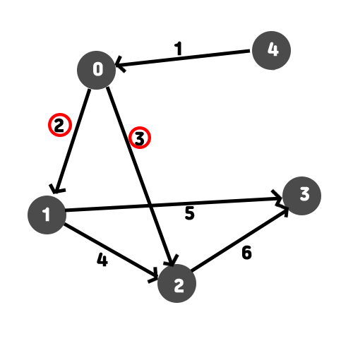
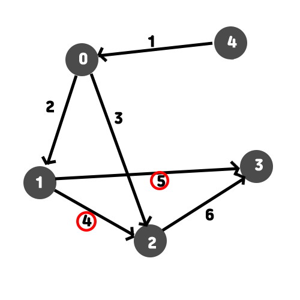

# 1753 원리 설명

처음에 힙큐에 시작 정점 좌표와 가중치를 넣는데

시작정점에서 시작정점까지는 제자리이므로 0을 넣어준다

그리고 시작 점에서 각 정점까지의 최단 거리를 저장하는 배열을 만들고 시작 점은 0, 나머지는

최댓값으로 초기화 한다

min = 0, INF, INF, INF, INF

힙큐에 들어가 있는 걸 pop해서 꺼내온다. 시작정점과 가중치를 넣엇으므로 (0,0) 이 나온다

그래서 정점 0에서 갈 수 있는 좌표를 탐색하는데, 예시를 보면 1, 2로 갈 수 있다.

여기서 하나씩 비교를 한다 

+ 0에서 1까지의 최단거리는 현재 INF로 저장되어 있다 = min[1]
+ 0에서 2까지의 최단거리는 현재 INF로 저장되어 있다. min[2]

1까지의 가중치인 2와 현재 힙큐에서 가져온 가중치 0을 더해서 min[1] 보다 작으면

min[1] 의 값을 0 + 2로 바꿔주고 힙큐에 정점 1과 정점1까지의 최소 가중치인 2를 넣는다

이어서 2까지의 가중치인 3과 현재 힙큐에서 가져온 가중치 0을 더해서 min[2]보다 작으면

min[2]의 값을 0 + 3으로 바꿔주고 힙큐에 정점 2와 정점2까지의 최소 가중치인 3을 넣는다

그러면 결과는 다음과 같다

min = 0, 2, 3, INF, INF    /    heapq = (1, 2), (2, 3)

다시 반복문으로 돌아와서 heapq의 제일 우선순위를 팝한다

정점 1과 정점1까지의 가중치인 2가 나온다

그러면 정점 1에서 갈수 있는 점들을 탐색한다

정점 2와 정점 3이 있다 이 과정은 순차적으로 진행되므로 정점 2를 살펴보자

+ 현재 정점 2까지의 최단거리는 3으로 저장되어 있다 = min[2]

정점 1까지의 가중치 2 (큐에 들어가있던 값) + 1~2까지의 거리 4를 더하면 6이 나오는데

이값은 현재 min[2] 보다 큰 값이 되어버리므로 2까지의 최단거리가 아니다 그러므로 이 값은

넣지 않고 다음 정점을 탐색한다

+ 현재 정점 3까지의 최단거리는 INF로 저장되어 있다 = min[3]

정점1까지의 가중치 2 + 3까지의 거리 5를 더하면 7인데 이것은 min[3]보다 작으므로

7이 최단거리이기 때문에 min[3]의 값을 7로 바꿔주고 힙큐에 정점 3과 3까지의 최소 가중치7

을 넣는다

현재 : min = 0, 2, 3, 7, INF    /   heapq = (2, 3) (3, 7)

....

이러한 과정으로 탐색을 거치게 되며

그냥 큐가 아니라 힙큐를 쓰는 이유는 가중치를 우선순위로 사용하여 큐에 넣게 되면

가중치가 적은것부터 값을 집어넣기 때문에 값을 여러번 바꿔주는 과정이 생략될 수 있다.